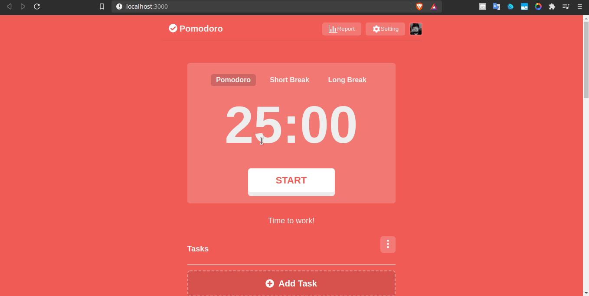

# Clone do layout @Pomofocus
Clone do layout de meu pomodoro online preferido com intuido praticar novas tecnologias

## Preview 🎉



## Tecnologias usadas
- ⚛ ReactJS
- ✨ React Hooks
- ⚡ Javascript
- 💄 Styled-components

### Para executa-lo em sua maquina:

```bash
git clone https://github.com/JoseMurilloc/clone-promofocus
cd clone-pomofocus
yarn
yarn start
```
---

